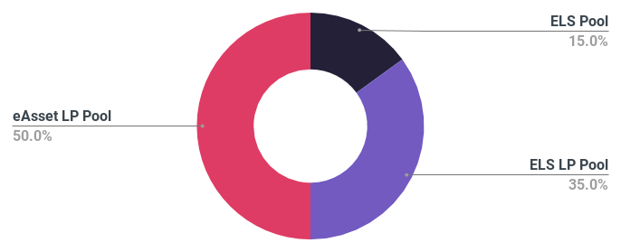
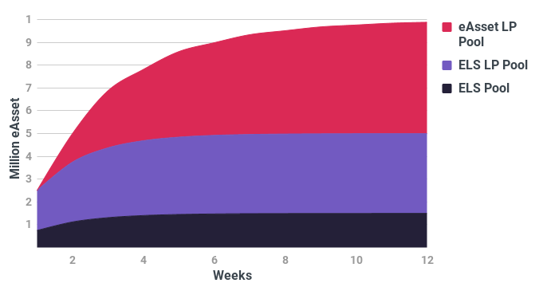
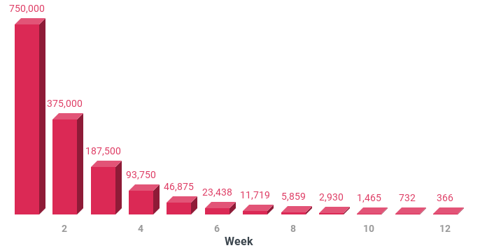
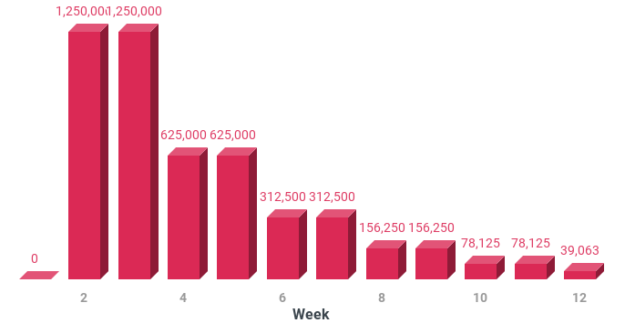

# Elastic Asset Distribution

# Tokenomics


Please note the information contained here is subject to change until the launch of the ELS presale.


### Final Distribution

The distribution structure at the end of 12 months will look like the below:

### Cumulative Distribution Schedule  

## Reward Pools

### ELS Pool

#### ELS Pool Halving Schedule

### ELS LP Pool

#### ELS LP Pool Halving Schedule

### eAsset LP Pool

#### eAsset LP Pool Halving Schedule

