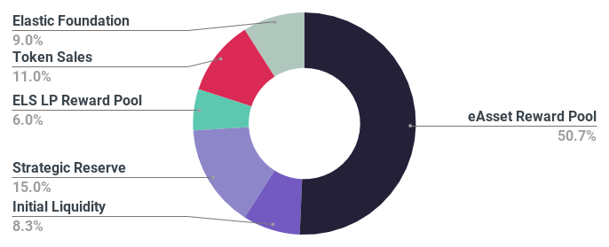
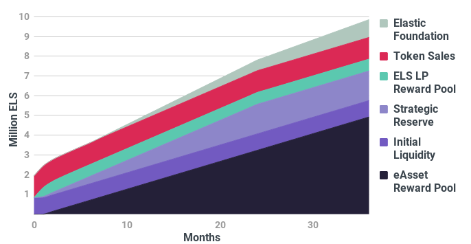

# Elastic Token Distribution


Please note the information contained here is subject to change until the launch of the ELS presale.


## Tokenomics

There is a total fixed-supply of 10 million ELS tokens created at genesis of the Elastic Protocol. This amount can never change and is set out in the rules of the ELS smart contract. 

At genesis a total of 2,533,000 ELS (25.33%) will move into circulation with the remaining 7,467,000 ELS (74.67%) locked in [time-released smart contract vaults](https://team.finance) with 99.20% of the total supply being released over a 3 year schedule.

### Initial Distribution

At genesis a total of 2,533,000 ELS (100% of the circulating supply) will become available to the public and will be distributed as follows:

#### Pre Sale 
*3.95% - 0.1 million ELS*  
Tokens will be available for the public to purchase through Elastic’s pre-sale event on [PolkaStarter](https://polkastarter.com/). Funds are assigned for marketing and launch costs. 

#### Public Sale 
*39.48% - 1 million ELS*  
Tokens will be available for the public to purchase through Elastic’s IDO (Initial DEX Offering) on PolkaStarter. 100% of funds raised are used to fund initial liquidity for the Uniswap ELS/ETH pair.

#### Liquidity
*32.89% - 0.833 million ELS*  
Tokens will be reserved for initial liquidity for the Uniswap ELS/ETH pair.

#### LP Reward Pool
*23.69% ~ 0.6 million ELS over 3 months*  
Tokens will be reserved for ELS LP Pool 1 which incentivizes further liquidity in the Uniswap ELS/ETH pool. ELS LP Pool 1 uses a halving schedule, with tokens paid monthly. After 3 months, 87.5% of the pool will be distributed.

### Final Distribution

The distribution structure at the end of 3 years will look like the below:

#### Elastic Foundation 
*9.00% - 0.9 million ELS over 30 months*  
[View vault](https://team.finance)  
Tokens will be released to current and future team members. Tokens are locked for 6 months and released monthly over a 30 month period.

#### Token Sales
*11.00% - 1.1 million ELS*  
The tokens originally released to the public via private and public sales will now account for 11.00% of the total token supply.

#### LP Reward Pool
*6.00% - 0.6 million ELS*  
Tokens distributed to ELS liquidity providers in ELS LP Pool 1 will now account for 6.00% of the total token supply.

#### Strategic Reserve 
*15.00% - 1.5 million over 36 months*  
[View vault](https://team.finance)  
Tokens will be released for growing the protocol eg: development, marketing, CEX listings, audits, market stabilization. Tokens are locked for 1 month and released monthly over a 36 month period.

#### Initial Liquidity
*8.33% - 0.833 million ELS*  
Tokens originally provided for initial uniswap liquidity will now account for 8.33% of the total token supply.

#### eAsset Reward Pool
*50.67% ~ 5.067 million ELS over 36 months*  
[View vault](https://team.finance)  
Tokens will be released to the public for incentivizing participation and liquidity in eAsset markets. Tokens are locked for 1 month and released monthly over a 36 month period following a 6 month halving schedule.

### Cumulative Distribution Schedule  

## Reward Pools

### LP Reward Pool(s)

#### ELS LP Pool 1

#### ELS LP Pool 1 Distribution Schedule

### eAsset Reward Pools

#### eAsset Pools

#### eAsset LP Pools

#### eAsset Reward Pools Cumulative Distribution Schedule

